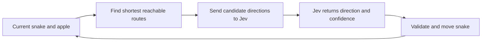

# Jev Snake

The game computes legal directions on the shortest reachable routes to the apple. Each turn, the local server sends the current board and those directions to Jev as a `Choice` question. Jev picks a direction; the game validates it and advances one cell. No move history is sent.

The TypeSafe API key stays in the local server process. The browser never receives it.
