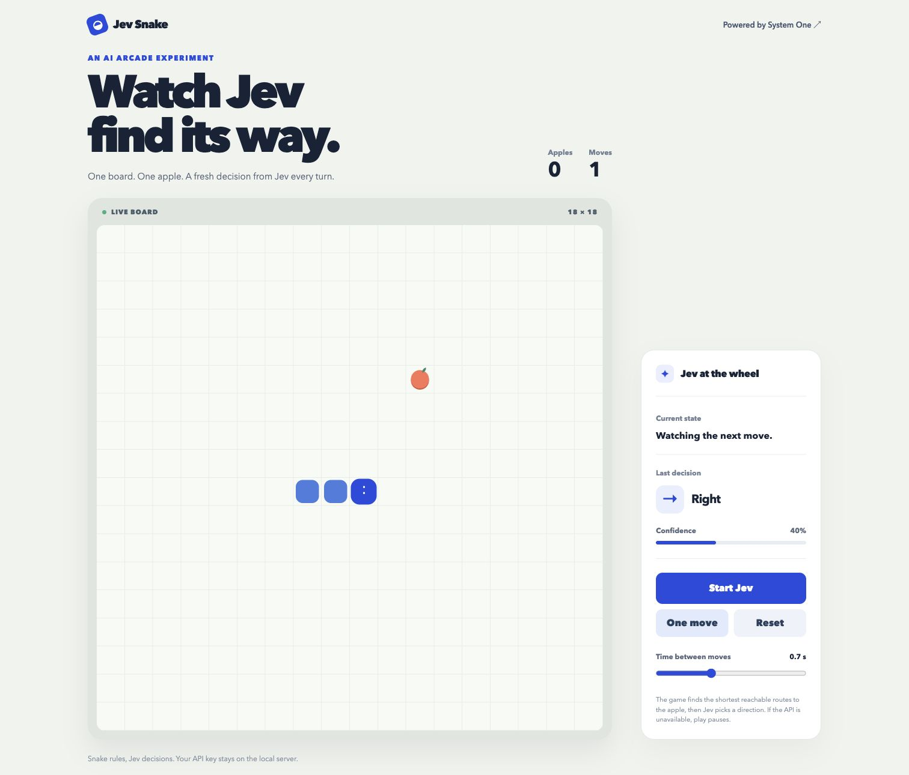
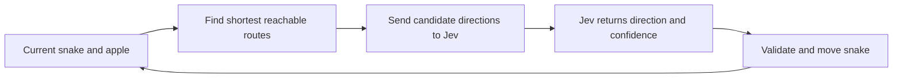

# Jev Snake



The game computes legal directions on the shortest reachable routes to the apple. Each turn, the local server sends the current board and those directions to Jev as a `Choice` question. Jev picks a direction; the game validates it and advances one cell. No move history is sent.



Example body sent to `POST https://api.typesafe.ai/v1/systemone`:

```json
{
  "model": "jev-latest",
  "state": {
    "board": { "width": 18, "height": 18 },
    "snake": [{ "x": 8, "y": 9 }, { "x": 7, "y": 9 }, { "x": 6, "y": 9 }],
    "food": { "x": 10, "y": 8 },
    "legal_moves": ["up", "right"]
  },
  "questions": {
    "next_move": {
      "type": "choice",
      "instructions": "Choose the snake's next move. The first snake cell is its head. Coordinates start at the top left; x increases right, y increases down. Eat the food while avoiding traps. Every listed move is legal now. Which direction is best?",
      "criteria": {
        "up": "Move up one cell.",
        "right": "Move right one cell."
      }
    }
  }
}
```

On a turn with the apple down and left, these fields instead contain:

```json
{
  "state": {
    "snake": [{ "x": 8, "y": 9 }, { "x": 9, "y": 9 }, { "x": 10, "y": 9 }],
    "food": { "x": 6, "y": 10 },
    "legal_moves": ["down", "left"]
  },
  "questions": {
    "next_move": {
      "criteria": {
        "down": "Move down one cell.",
        "left": "Move left one cell."
      }
    }
  }
}
```

The TypeSafe API key stays in the local server process. The browser never receives it.
